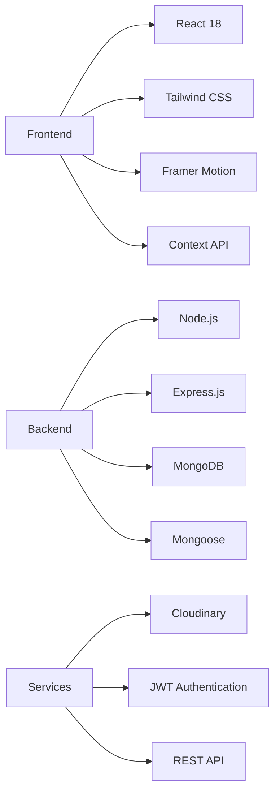
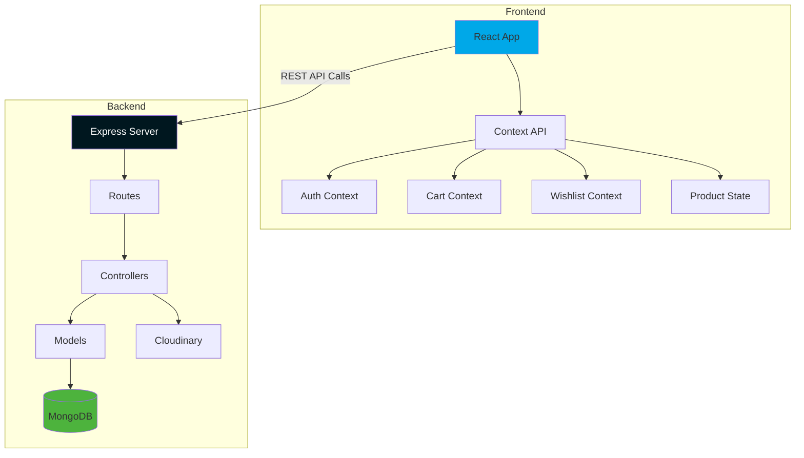
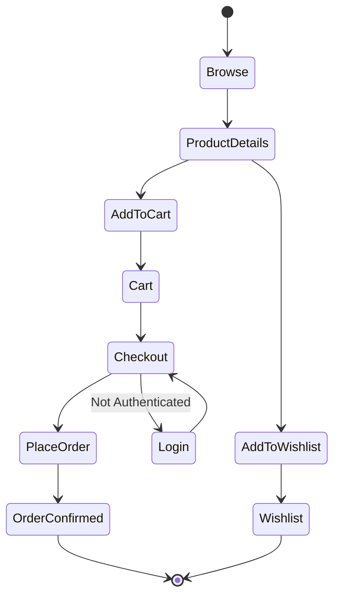
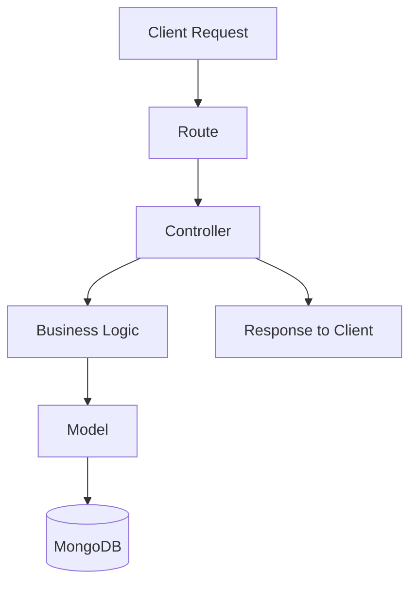
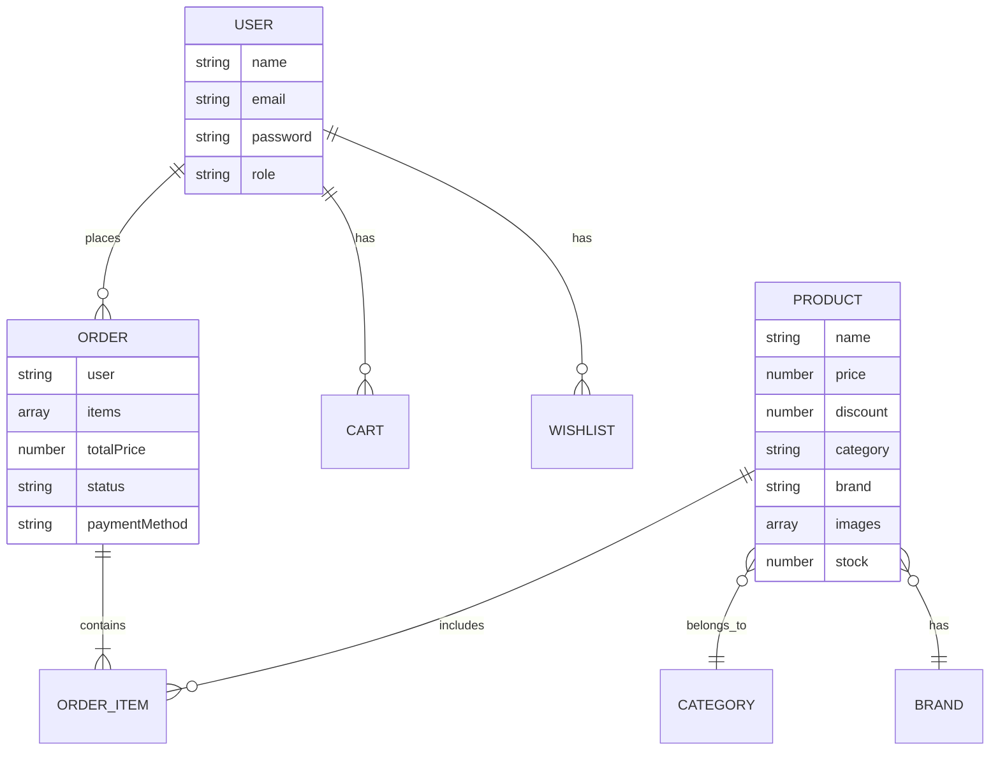

## Project Overview
CrickCart is a full-stack MERN e-commerce platform built for cricket enthusiasts, offering a seamless shopping experience for premium cricket equipment.  
It includes secure authentication, advanced product discovery, cart and wishlist management, order tracking, admin controls, and cloud-based media handling.

---

## Features
- JWT-based authentication with role-based access (user/admin)
- Product search, filter by category, price range, and sort
- Cloudinary image upload for products and categories
- Cart with quantity management and real-time price calculation
- Wishlist with optimistic UI updates
- Multi-step checkout with demo payment simulation
- Order tracking with status management
- Admin dashboard — product, category, order, and user management
- Pagination on product listing and admin tables
- Fully responsive mobile-first design

---

## Tech Stack Diagram

---

## System Architecture

---

## User Flow / State Diagram

---

## Backend MVC Structure

---

## Database ER Diagram

---

## Deployment
- **Frontend**: Vercel
- **Backend**: Render
- **Database**: MongoDB Atlas
- **Media**: Cloudinary CDN